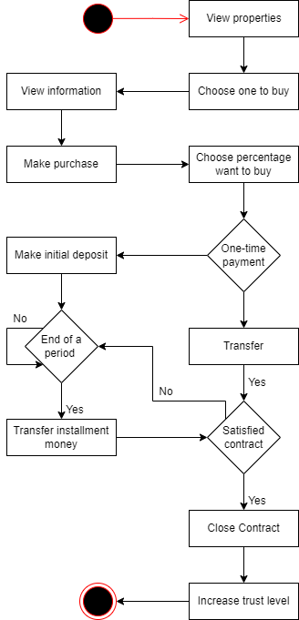

# VGU Project Group: Berlin



# How to deploy the backend (Hyperledger Fabric)

This guides assume that you are running it in a Unix-like environment such as
WSL, MacOS, Linux, etc

Inside the folder ./network/ there exist a bash script called manager.

## Install manager script to your machine

``` bash
cd ./network/
./manager
```

**If you are not a root user (in WSL you are root by default) then manager
script will ask for your root password and you need to run the script again by
typing ./manager**

After this step manager script is installed inside /usr/bin/ as a soft symbolic link \
**you can type manager anywhere inside VGU_Project_Berlin and it would work no 
need to go inside network folder**

## Bringing up the network

```bash
manager up
```

## Deploy the chaincode on mychannel channel
Each channel requires two chaincodes in order to operate: basic and token_erc20

install basic chaincode:

```bash
manager d -t public -c mychannel
```
or 

```bash
manager d
```

then install token chaincode

```bash
manager d -t token -c mychannel
```
or 

```bash
manager d -t token
```

By default the chaincode type will be public (basic chaincode) and the channel 
it deploys to is mychannel

**If you encounter network error try switching to using mobile data services
such as 3/4G**

If the script encounter a network error press Ctrl+C to cancel execution 
immediately.

Then retry to install the chaincode by running:

```bash
manager u -t public -c mychannel
```
or
```bash
manager u
```

then install token chaincode

```bash
manager u -t token -c mychannel
```
or 

```bash
manager u -t token
```
## Check if the chaincode is installed on mychannel

```bash
manager c -c mychannel
```

or 

```bash
manager c
```

If successful the terminal will show something like this: \
Committed chaincode definitions on channel 'mychannel': \
Name: basic, Version: 3, Sequence: 1, Endorsement Plugin: escc, Validation Plugin: vscc \
Name: token_erc20, Version: 1, Sequence: 1, Endorsement Plugin: escc, Validation Plugin: vscc 

## Deploy the chaincode on business channel

```bash
manager d -t public -c business
```

if fail

```bash
manager u -t public -c business
```

install token chaincode

```bash
manager d -t token -c business
```

if fail

```bash
manager u -t token -c business
```

check if installed

```bash
manager c -c business
```
if success:

Committed chaincode definitions on channel 'business': \
Name: basic, Version: 1.0, Sequence: 1, Endorsement Plugin: escc, Validation Plugin: vscc \
Name: token_erc20, Version: 1.0, Sequence: 1, Endorsement Plugin: escc, Validation Plugin: vscc 
